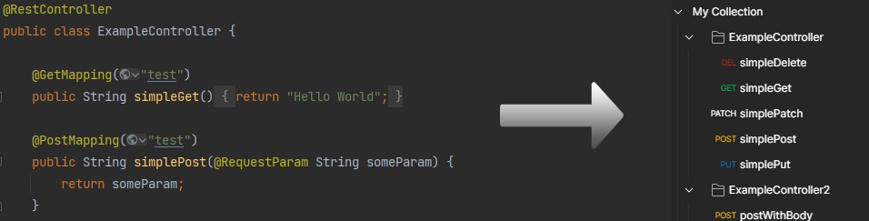

[](https://maven-badges.herokuapp.com/maven-central/io.github.sampaiodias/postman-exporter)

# Postman Exporter for Spring

This project is a simple Java library that can export all of your Spring endpoints into a Postman Collection json, which you can import on Postman. This library is fairly new, so feedback is greatly appreciated.



Example:
```java
PostmanExporter exporter = new PostmanExporter();
String json = exporter.export("Collection Name", "localhost:8080", "com.example.package");
```

To use this library on your project:
```java
<dependency>
    <groupId>io.github.sampaiodias</groupId>
    <artifactId>postman-exporter</artifactId>
    <version>0.2.0</version>
</dependency>
```

## Features
- Supportes all Mapping annotations: @RequestMapping, @GetMapping, @PostMapping, @PutMapping, @DeleteMapping, @PatchMapping.
- Generates Postman requests configured with request methods (GET, POST, etc.), Params and Body. 
- Groups requests into folders (one folder per class/Controller)
